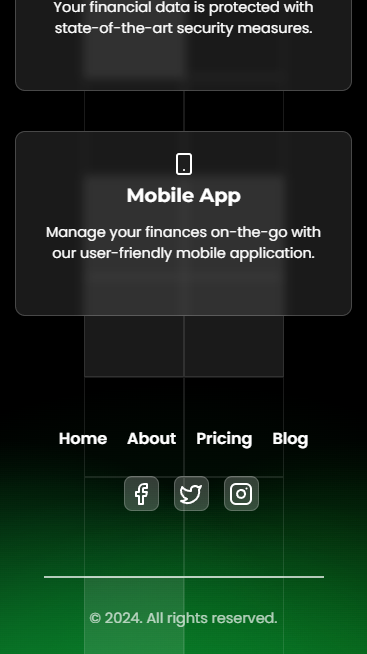
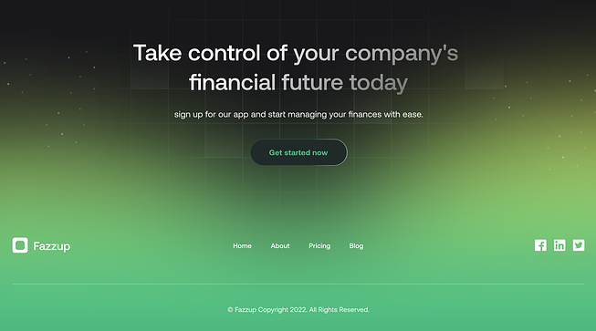

<!-- Projeto Finalizado -->
# 🧪 **Financial Vision**
<p align="center">
  <!-- Contador de linguagens do GitHub -->
  
   <!-- Tamanho do repositório no GitHub -->
  
  <!-- Licença do GitHub -->
  
</p>

<div align="center">
  
</div>

## 📋 **Sobre o Projeto**
Financial Vision é uma landing page moderna e dinâmica para uma aplicação de gestão financeira empresarial. Desenvolvida com HTML, CSS e JavaScript, a página oferece uma experiência de usuário envolvente e responsiva.

## 🚀 **Como Usar**
1. Clone este repositório:
   ```bash
   git clone https://github.com/devAndreotti/financial-vision.git
   ```
2. Abra o arquivo `index.html` no seu navegador preferido.

## 🔍 Visualize o Projeto
Confira o projeto online através deste [link](https://devandreotti.github.io/financial-vision/).

## ⚙️Características
- [x] Seção de recursos interativa.
- [x] Design responsivo.
- [x] Grid animado.

## 🛠️ **Tecnologias Utilizadas**
- [Lucide Icons](https://lucide.dev/) - Biblioteca de ícones modernos e personalizáveis
- [Google Fonts](https://fonts.google.com/) - Fontes Montserrat e Poppins para tipografia elegante
- [JavaScript](https://developer.mozilla.org/pt-BR/docs/Web/JavaScript) - Para animações e interatividade
- [CSS](https://developer.mozilla.org/pt-BR/docs/Web/CSS) - Estilização avançada e efeitos visuais
- [HTML](https://developer.mozilla.org/pt-BR/docs/Web/HTML) - Estruturação do conteúdo

## 📱 Demo
<div align="center">
  
  
</div>

## 📂 **Estrutura do Projeto**
```bash
financial-vision/
│
├── styles/
│   └── index.css
│
├── js/
│   ├── grid.js
│   └── floating-circles.js
│
├── img/
│   └── icon.png
│
├── index.html
└── README.md
```

## ✒️ Inspiração do Design
<div align="center">
  
</div>

## 💪 Como Contribuir
Contribuições são bem-vindas! Siga estas etapas:
1. Faça um fork do projeto.
2. Crie uma nova branch: `git checkout -b feature/nova-funcionalidade`.
3. Faça suas alterações e commit: `git commit -m 'Adiciona nova funcionalidade'`.
4. Push para a branch: `git push origin feature/nova-funcionalidade`.
5. Abra um Pull Request.

## 📝 Nota
Este projeto é uma demonstração de habilidades em design web e desenvolvimento front-end, focando em criar uma experiência de usuário moderna e atraente para uma aplicação financeira.

<br>

---
<p align="center"> Desenvolvido por <a href="https://github.com/devAndreotti">Ricardo Andreotti Gonçalves</a> </p>
